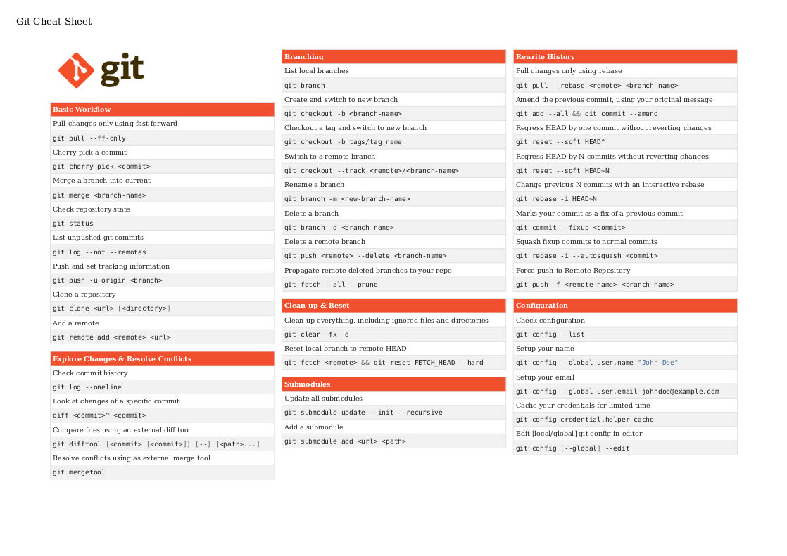

# MDdoc

Simple script to render beautiful HTML from Markdown.

### Quickstart

```bash
pipenv install .
```

### Example

See an example here:

```bash
cd examples/git
mddoc -t git.html git.md -o out.html
```

This produces the following (printable) page:

